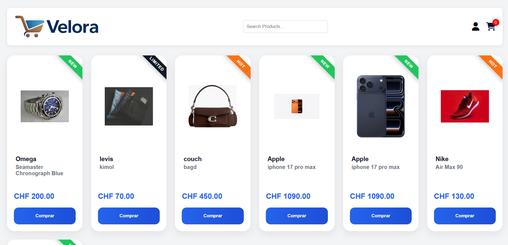
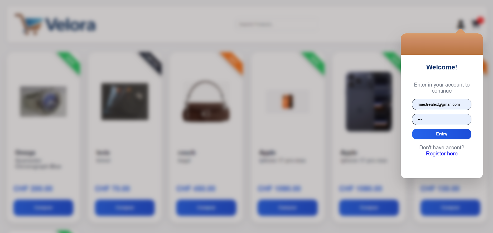
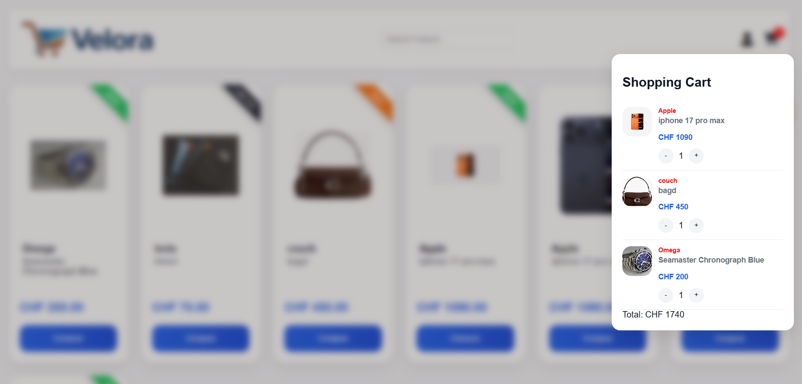
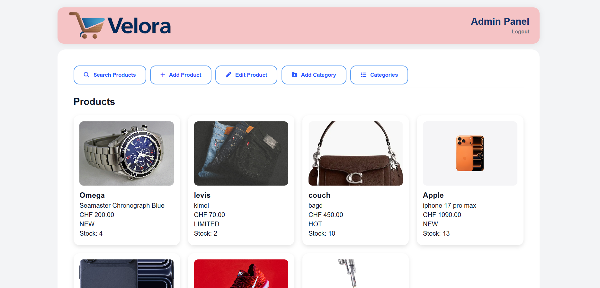
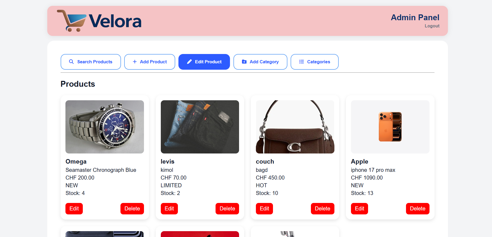

Velora E-Commerce Project

A full-stack e-commerce platform developed with PHP, MySQL, JavaScript, HTML5, and CSS3.

Overview

Velora is a web-based e-commerce application built as a practical learning project to develop full-stack web development skills.

The project focuses on:

* User authentication
* Product management
* Shopping cart functionality
* Category management
* Database integration
* Admin dashboard development
* File uploads
* Session management
* Code organization and security best practices

⸻

Features

Customer Area

* User registration
* User login and logout
* Product catalog
* Product search
* Shopping cart
* Product badges (NEW, SALE, HOT, LIMITED)
* Responsive interface

Admin Area

* Secure admin access
* Product creation
* Product editing
* Product deletion
* Category creation
* Category deletion
* Product search
* Product filtering by category
* Image upload system

⸻

 Screenshots

* Homepage

* Login

* Shopping Cart

* Admin Dashboard

* Edit Product

⸻

Technologies Used

Backend

* PHP 8+
* MySQL
* PHP Sessions
* Prepared Statements

Frontend

* HTML5
* CSS3
* JavaScript (Vanilla JavaScript)
* Font Awesome

Development Tools

* XAMPP
* Visual Studio Code
* Git
* GitHub

⸻

Project Structure

loja/
├── admin.php
├── index.php
├── login.php
├── logout.php
├── register.php
├── products.php
│
├── includes/
│   └── db.php
│
├── css/
│   ├── style.css
│   └── admin.css
│
├── js/
│   ├── script.js
│   └── admin.js
│
├── images/
│
├── screenshots/
│
└── uploads/
    └── products/

⸻

Current Status

Project actively under development.

Completed Features

* Authentication system
* Admin dashboard
* Product management
* Category management
* Shopping cart
* Product search
* Product filtering
* Product badges
* Image uploads

Planned Improvements

* Order management system
* Checkout process
* Stock validation
* User profile page
* Order history
* Improved security
* REST API integration

⸻

Author

Alex Mestre

This project was created as part of my journey into full-stack web development, focusing on PHP, MySQL, JavaScript, software architecture, and clean coding practices.

⸻

License

This project is intended for educational and portfolio purposes.